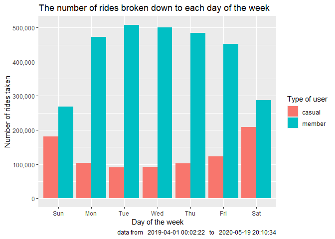

Bike-share CaseStudy
================
Gabor Ricsli
2023-02-04

<br> <br>

## Building success for Cyclistic

### How can a the company generate more member subscriptions

<br> <br>

### Setting the goal:

- Observe the patterns and trends in the usage of the bicycles owned by
  Cyclistic in an over 12 months period

- Identify the behavioral differences between the two different types of
  users in different perspectives

- Make suggestions how the company would be able to increase the number
  of subscriptions, converting casual users to members

------------------------------------------------------------------------

<br>

### Setting up the enviorment

<br>

#### Install and load necessary packages:

``` r
install.packages("tidyverse", repos = "http://cran.us.r-project.org")
```

    ## Installing package into 'C:/Users/TheG/AppData/Local/R/win-library/4.2'
    ## (as 'lib' is unspecified)

    ## package 'tidyverse' successfully unpacked and MD5 sums checked
    ## 
    ## The downloaded binary packages are in
    ##  C:\Users\TheG\AppData\Local\Temp\RtmpGC8uSQ\downloaded_packages

``` r
library(tidyverse)
```

    ## ── Attaching packages ─────────────────────────────────────── tidyverse 1.3.2
    ## ──

    ## ✔ ggplot2 3.4.0      ✔ purrr   1.0.1 
    ## ✔ tibble  3.1.8      ✔ dplyr   1.0.10
    ## ✔ tidyr   1.2.1      ✔ stringr 1.5.0 
    ## ✔ readr   2.1.3      ✔ forcats 0.5.2 
    ## ── Conflicts ────────────────────────────────────────── tidyverse_conflicts() ──
    ## ✖ dplyr::filter() masks stats::filter()
    ## ✖ dplyr::lag()    masks stats::lag()

``` r
library(dplyr)
library(ggplot2)
library(here)
```

    ## here() starts at C:/Users/TheG/Desktop/Data Analytics 2023/Course 8 (Capstone)/Bike_CaseStudy

``` r
library(janitor)
```

    ## 
    ## Attaching package: 'janitor'
    ## 
    ## The following objects are masked from 'package:stats':
    ## 
    ##     chisq.test, fisher.test

``` r
library(lubridate)
```

    ## Loading required package: timechange
    ## 
    ## Attaching package: 'lubridate'
    ## 
    ## The following objects are masked from 'package:base':
    ## 
    ##     date, intersect, setdiff, union

``` r
library(readr)
library(scales)
```

    ## 
    ## Attaching package: 'scales'
    ## 
    ## The following object is masked from 'package:purrr':
    ## 
    ##     discard
    ## 
    ## The following object is masked from 'package:readr':
    ## 
    ##     col_factor

``` r
library(skimr)
library(tidyr)
```

#### Load the data sets:

``` r
q2_2019 = read.csv("Divvy_Trips_2019_Q2.csv")
q3_2019 = read.csv("Divvy_Trips_2019_Q3.csv")
q4_2019 = read.csv("Divvy_Trips_2019_Q4.csv")
q1_2020 = read.csv("Divvy_Trips_2020_Q1.csv")
```

------------------------------------------------------------------------

<br>

### Setting up the data for cleaning

<br>

#### Renaming 2019 data frames so the column names will match 2020 data frame:

``` r
q4_2019 = rename(q4_2019,
                 ride_id = trip_id,
                 rideable_type = bikeid,
                 started_at = start_time,
                 ended_at = end_time,
                 start_station_name = from_station_name,
                 start_station_id = from_station_id,
                 end_station_name = to_station_name,
                 end_station_id = to_station_id,
                 member_casual = usertype
                 )

q3_2019 = rename(q3_2019,
                 ride_id = trip_id,
                 rideable_type = bikeid,
                 started_at = start_time,
                 ended_at = end_time,
                 start_station_name = from_station_name,
                 start_station_id = from_station_id,
                 end_station_name = to_station_name,
                 end_station_id = to_station_id,
                 member_casual = usertype
                 )

q2_2019 = rename(q2_2019,
                 ride_id = "X01...Rental.Details.Rental.ID",
                 rideable_type = "X01...Rental.Details.Bike.ID",
                 started_at = "X01...Rental.Details.Local.Start.Time",
                 ended_at = "X01...Rental.Details.Local.End.Time",
                 start_station_name = "X03...Rental.Start.Station.Name",
                 start_station_id = "X03...Rental.Start.Station.ID",
                 end_station_name = "X02...Rental.End.Station.Name",
                 end_station_id = "X02...Rental.End.Station.ID",
                 member_casual = "User.Type"
                 )
```

<br>

#### Formatting attributes in 2019 data frames so the format would match with 2020 one:

``` r
q4_2019 = mutate(q4_2019, ride_id = as.character(ride_id),
                 rideable_type = as.character(rideable_type))

q3_2019 = mutate(q3_2019, ride_id = as.character(ride_id),
                 rideable_type = as.character(rideable_type))

q2_2019 = mutate(q2_2019, ride_id = as.character(ride_id),
                 rideable_type = as.character(rideable_type))
```

<br>

#### Making one big table out of the 4 data frames:

``` r
all_trips = bind_rows(q2_2019, q3_2019, q4_2019, q1_2020)
```

<br>

#### Converting the started_at and ended_at columns to datetime so we can make calculations with it:

``` r
all_trips = mutate(all_trips, started_at = as_datetime(started_at),
                   ended_at = as_datetime(ended_at))
```

<br>

#### Getting rid of all the unnecessary columns:

``` r
all_trips = all_trips %>% 
  select(-c("X01...Rental.Details.Duration.In.Seconds.Uncapped",  Member.Gender,
            "X05...Member.Details.Member.Birthday.Year", tripduration, gender,
            birthyear, start_lat, start_lng, end_lat, end_lng))
```

------------------------------------------------------------------------

<br>

### Cleaning the data

<br>

#### In member_casual column we have 4 different attributes instead of 2. Making 2 out of 4 by assigning the other 2 accordingly:

``` r
all_trips = all_trips %>% 
  mutate(member_casual = recode(member_casual,
                                "Customer" = "casual",
                                "Subscriber" = "member"))
```

<br>

#### To be able to aggregate ride data efficiently, we have to add a more columns separating the day, month, and year:

``` r
all_trips$date = as.Date(all_trips$started_at)

all_trips$year = format(as.Date(all_trips$date), "%Y")
all_trips$month = format(as.Date(all_trips$date), "%m")
all_trips$day = format(as.Date(all_trips$date), "%d")
all_trips$day_of_week = format(as.Date(all_trips$date), "%A")
```

<br>

#### Adding a new column calculating the travel time:

``` r
all_trips$ride_length = difftime(all_trips$ended_at, all_trips$started_at)
```

<br>

#### Converting ride_length from numeric.difftime to numeric:

``` r
all_trips$ride_length = as.numeric(as.character(all_trips$ride_length))
```

<br>

#### Removing “bad” data. We have to take out all the data where the bike is at service/HQ QR/ or the ride time is negative:

``` r
all_trips_v2 = all_trips[!(all_trips$start_station_name == "HQ QR" | all_trips$ride_length < 0),]
```

------------------------------------------------------------------------

<br>

### Analyzing data

<br>

#### Getting statistical information about ride_length:

``` r
summary(all_trips_v2$ride_length)
```

    ##    Min. 1st Qu.  Median    Mean 3rd Qu.    Max. 
    ##       1     412     712    1479    1289 9387024

<br>

#### Compare members with casuals using statistical attributes:

``` r
aggregate(all_trips_v2$ride_length ~all_trips_v2$member_casual, FUN = mean)
```

    ##   all_trips_v2$member_casual all_trips_v2$ride_length
    ## 1                     casual                3552.7502
    ## 2                     member                 850.0662

``` r
aggregate(all_trips_v2$ride_length ~all_trips_v2$member_casual, FUN = median)
```

    ##   all_trips_v2$member_casual all_trips_v2$ride_length
    ## 1                     casual                     1546
    ## 2                     member                      589

``` r
aggregate(all_trips_v2$ride_length ~all_trips_v2$member_casual, FUN = min)
```

    ##   all_trips_v2$member_casual all_trips_v2$ride_length
    ## 1                     casual                        2
    ## 2                     member                        1

``` r
aggregate(all_trips_v2$ride_length ~all_trips_v2$member_casual, FUN = max)
```

    ##   all_trips_v2$member_casual all_trips_v2$ride_length
    ## 1                     casual                  9387024
    ## 2                     member                  9056634

<br>

#### Setting up a preferred order of the weekdays:

``` r
all_trips_v2$day_of_week = ordered(all_trips_v2$day_of_week,
                                   levels = c("Monday", "Tuesday", "Wednesday", "Thursday",
                                              "Friday", "Saturday", "Sunday"))
```

<br>

#### See how long/average/ the members vs casuals use the bikes on a certain day of the week:

``` r
aggregate(all_trips_v2$ride_length ~all_trips_v2$member_casual + all_trips_v2$day_of_week, FUN = mean)
```

    ##    all_trips_v2$member_casual all_trips_v2$day_of_week all_trips_v2$ride_length
    ## 1                      casual                   Monday                3372.2869
    ## 2                      member                   Monday                 842.5726
    ## 3                      casual                  Tuesday                3596.3599
    ## 4                      member                  Tuesday                 826.1427
    ## 5                      casual                Wednesday                3718.6619
    ## 6                      member                Wednesday                 823.9996
    ## 7                      casual                 Thursday                3682.9847
    ## 8                      member                 Thursday                 823.9278
    ## 9                      casual                   Friday                3773.8351
    ## 10                     member                   Friday                 824.5305
    ## 11                     casual                 Saturday                3331.9138
    ## 12                     member                 Saturday                 968.9337
    ## 13                     casual                   Sunday                3581.4054
    ## 14                     member                   Sunday                 919.9746

<br>

#### Comparing casuals and members by the number of rides were taken and the average duration the ride lasted/in hours/:

``` r
rides_and_duration = all_trips_v2 %>% 
  mutate(weekday = wday(started_at, label = TRUE)) %>% 
  group_by(member_casual, weekday) %>% 
  summarise(number_of_rides = n(), average_duration = (mean(ride_length) / 60)) %>% 
  arrange(weekday, member_casual)
```

    ## `summarise()` has grouped output by 'member_casual'. You can override using the
    ## `.groups` argument.

<br>

#### Defining the time frame in variables so we can use them to add labels to the plot later:

``` r
start_time = min(all_trips_v2$started_at)
finish_time = max(all_trips_v2$ended_at)
```

<br>

#### Making a column chart about the number of rides in respect of weekdays and member status:

``` r
ggplot(rides_and_duration, aes(x = rides_and_duration$weekday, y = rides_and_duration$number_of_rides,
                               fill = rides_and_duration$member_casual)) + geom_col(position = "dodge") +
  labs("text", title = "The number of rides broken down to each day of the week", 
       caption = paste("data from  ", start_time, "  to  ", finish_time),
       x = "Day of the week", y = "Number of rides taken", fill = "Type of user") +
  scale_y_continuous(labels = comma)
```

<!-- -->
<br>

- Understandably the number of rides taken by members exceed the number
  of rides taken by casuals riders.

- As members have subscriptions, they are charged no extra fees for
  taking extra rides.

- Also visible that the preferred period for members is weekdays while
  the preferred period for casual riders is weekends

<br>

#### Making a column chart about the ride duration in respect of weekdays and member status:

``` r
ggplot(rides_and_duration, aes(x = rides_and_duration$weekday, y = rides_and_duration$average_duration,
                               fill = rides_and_duration$member_casual)) + geom_col(position = "dodge") +
  labs("text", title = "Average ride time broken down to weekdays",
       caption = paste("date from  ", start_time, "  to  ", finish_time),
       x = "Day of the week", y = "Average ride time in minutes", fill = "Type of user")
```

<!-- -->
<br>

- We can see straight away that there is a significant difference
  between member and casual riding times

- The average riding time for casual members is around 1 hour throughout
  the whole week, while the same for members is 10-20 minutes.

- As there is no significant variance in the riding times we can state
  that the casual users generally use the bicycles longer.

<br>

#### Summarize overall ride duration throughout the year and compare the usage of members and casuals:

``` r
bike_usage = all_trips_v2 %>% 
  mutate(weekday = wday(started_at, label = TRUE)) %>% 
  group_by(weekday, member_casual) %>% 
  summarise(overall_usage_h = sum(ride_length)) %>% 
  arrange(weekday, member_casual)
```

    ## `summarise()` has grouped output by 'weekday'. You can override using the
    ## `.groups` argument.

<br>

#### Making a column chart about the overall bike usage between members and casuals in respect of weekdays:

``` r
ggplot(bike_usage, aes(x = bike_usage$weekday, y = bike_usage$overall_usage_h,
                       fill = bike_usage$member_casual)) + geom_col(position = "dodge") +
  labs("text", title = "Overall ridetime in the observed period", 
       caption = paste("data from  ", start_time, "  to  ", finish_time),
       x = "Day of the week", y = "Overall ride time [h]", fill = "Type of user")
```

<!-- -->
<br>

- Previously we saw that members use the bikes more but casual users use
  the bikes longer so now we need to see how the overall usage is.

- During the weekdays members have a general dominance in usage however
  the difference is not significant

- On weekends however we can see that casuals use the bike more than
  twice as much as members

------------------------------------------------------------------------

<br>

### Summary of the analysis

<br>

- There is little variation but an overall difference of the riding
  times in favour of the casual users.

- The number of rides taken by members exceed the casual numbers on any
  day of the week, but worth to mention that the weekends are when
  casual users have the highest ride numbers and members have the
  lowest.

- The overall usage of the bicycles only varies significantly in
  weekends, where casual riders tend to use the bikes the most and their
  usage highly exceeds the members’ times.

<br>

#### **The goal is to attract casual users so they would subscribe for a membership. We can address the major differences in usage on the weekends to find a solution.**

#### **Having a really high demand from casual riders on weekends suggests that adding an option for weekend membership would be the most beneficial solution.**

<br> <br>
